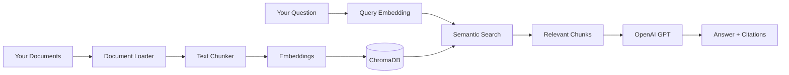

# AI and RAG Features

Comprehensive guide to AI capabilities and Retrieval Augmented Generation (RAG) in the NAS Telegram AI Assistant.

---

## Table of Contents

1. [What is RAG?](#what-is-rag)
2. [How It Works](#how-it-works)
3. [AI Models](#ai-models)
4. [Document Indexing](#document-indexing)
5. [Asking Questions](#asking-questions)
6. [Internet Search](#internet-search)
7. [Conversation History](#conversation-history)
8. [Best Practices](#best-practices)
9. [Cost Optimization](#cost-optimization)
10. [Troubleshooting](#troubleshooting-ai)

---

## What is RAG?

**RAG (Retrieval Augmented Generation)** is an AI technique that combines:
- **Retrieval**: Searching your documents for relevant information
- **Augmented**: Enhancing AI responses with retrieved context
- **Generation**: Creating answers based on both AI knowledge and your documents

### Why RAG?

**Without RAG**:
- AI only knows what it was trained on (up to its knowledge cutoff)
- Cannot answer questions about your specific documents
- May hallucinate or provide generic answers

**With RAG**:
- AI searches your documents first
- Answers based on YOUR content
- Cites sources from your files
- More accurate and relevant responses

### Use Cases

- **Study Materials**: "Explain the IELTS writing criteria from my notes"
- **Work Documents**: "What's our deployment process according to the docs?"
- **Personal Knowledge Base**: "What did I write about Docker security?"
- **Research**: "Summarize all my notes about machine learning"

---

## How It Works

### The RAG Pipeline



### Step-by-Step Process

1. **Document Ingestion**
   - Bot scans your `DOCUMENT_PATH`
   - Extracts text from PDF, DOCX, TXT, MD files
   - Splits into manageable chunks (~1000 chars)

2. **Creating Embeddings**
   - Each chunk converted to vector (embedding)
   - Embeddings capture semantic meaning
   - Stored in ChromaDB vector database

3. **Query Processing**
   - Your question converted to embedding
   - Semantic search finds similar chunks
   - Top relevant chunks retrieved

4. **Response Generation**
   - Retrieved chunks sent to OpenAI
   - AI generates answer based on context
   - Includes citations to source files

---

## AI Models

The bot uses multiple OpenAI models for different tasks:

### GPT-5.4-Nano (Default Model)

**Purpose**: Fast, efficient general tasks

**Best for**:
- Quick document Q&A
- Simple explanations
- General chat
- Summaries

**Characteristics**:
- Fastest response time
- Lowest cost
- Good for most queries

**Cost**: ~$0.15 per 1M input tokens

**Commands**: `/ask`, `/chat`, `/summarize`, `/explain`

---

### GPT-4o-Mini (Fallback Model)

**Purpose**: Balanced quality and speed

**Best for**:
- More complex queries
- When nano isn't available
- Detailed analysis

**Characteristics**:
- Medium speed
- Medium cost
- Reliable fallback

**Cost**: ~$0.60 per 1M output tokens

**Used**: Automatically when nano unavailable

---

### O3-Mini (Thinking Model)

**Purpose**: Advanced reasoning and analysis

**Best for**:
- Complex problem-solving
- Multi-step reasoning
- Strategic planning
- Technical analysis

**Characteristics**:
- Slower (thinks more)
- More expensive
- Best quality reasoning

**Cost**: ~$3-12 per 1M tokens

**Commands**: `/analyze`, `/think`

**Example**:
```
You: /analyze Should I use Docker Swarm or 
     Kubernetes for my 5-container home lab?
     
Bot: [Detailed analysis considering:
     - Your specific use case
     - Resource requirements
     - Learning curve
     - Maintenance overhead
     - Recommendation with reasoning]
```

---

### When to Use Which Model

| Task | Recommended Model | Command |
|------|------------------|---------|
| Quick document lookup | GPT-5.4-Nano | `/ask` |
| General chat | GPT-5.4-Nano | `/chat` |
| Summarize documents | GPT-5.4-Nano | `/summarize` |
| Simple explanations | GPT-5.4-Nano | `/explain` |
| Complex analysis | O3-Mini | `/analyze` |
| Multi-step reasoning | O3-Mini | `/think` |
| Internet search | GPT-4o-Mini | `/websearch` |

---

## Document Indexing

### Supported Formats

- **PDF** - Portable Document Format
- **DOCX** - Microsoft Word
- **TXT** - Plain text
- **MD** - Markdown

### Adding Documents

1. **Place files in documents folder**:
   ```bash
   cp ~/my-docs/*.pdf /path/to/BOT/documents/
   ```

2. **Run index command**:
   ```
   /index
   ```

3. **Wait for completion**:
   - Progress updates shown
   - Takes time based on document count
   - Only needed when documents change

### Index Process

```
You: /index

Bot: 📊 Starting document indexing...
     
     Scanning /app/documents...
     Found 42 documents
     
     Processing PDFs: 15/15 ✓
     Processing DOCX: 8/8 ✓
     Processing TXT: 12/12 ✓
     Processing MD: 7/7 ✓
     
     Creating embeddings...
     Progress: [▓▓▓▓▓▓▓▓▓▓] 100%
     
     ✅ Indexing complete!
     Documents: 42
     Total chunks: 385
     Time: 2m 15s
```

### Index Duration

| Document Count | Estimated Time |
|---------------|----------------|
| 10 documents | 30 seconds |
| 50 documents | 2-3 minutes |
| 100 documents | 5-7 minutes |
| 500 documents | 20-30 minutes |
| 1000+ documents | 45+ minutes |

**Factors affecting speed**:
- Document size
- File format (PDFs slower than TXT)
- System resources
- Network speed (embeddings use API)

### When to Re-Index

- Added new documents
- Updated existing documents
- Deleted documents
- Search results seem outdated
- After significant content changes

### Index Storage

**Location**: `CHROMA_PATH` (default: `./data/chroma_db`)

**Size**: Varies by document count
- 100 documents: ~50-100 MB
- 1000 documents: ~500 MB - 1 GB

**Backup**: Include in regular backups

---

## Asking Questions

### The `/ask` Command

**Purpose**: Ask questions about your indexed documents

**Syntax**:
```
/ask <your question>
```

### Query Types

#### 1. Direct Questions
```
You: /ask What are the IELTS band descriptors for writing?
Bot: Based on ielts-guide.pdf, IELTS writing band 
     descriptors assess four criteria:
     1. Task Achievement...
```

#### 2. Comparison Questions
```
You: /ask What's the difference between Task 1 and Task 2 in IELTS writing?
Bot: According to your documents:
     
     Task 1:
     - Describe visual information...
     
     Task 2:
     - Essay writing...
```

#### 3. List Questions
```
You: /ask Give me all the tips for IELTS speaking from my notes
Bot: Here are the speaking tips from your documents:
     1. Practice regularly...
     2. Record yourself...
     [Citations: ielts-speaking.pdf, study-notes.md]
```

#### 4. Explanation Questions
```
You: /ask Explain cohesion in IELTS writing
Bot: Based on your IELTS materials, cohesion refers to...
```

### Citations

Responses include source information:

```
Bot: [Answer here]

Sources:
📄 ielts-writing-guide.pdf (pages 15-17)
📄 study-notes-2025.md
```

---

## Internet Search

### The `/websearch` Command

**Purpose**: Search the internet and get AI-summarized results

**Requirements**: Serper or Tavily API key

**Syntax**:
```
/websearch <query>
```

### How It Works

1. Query sent to search API (Serper/Tavily)
2. Top search results retrieved
3. AI summarizes findings
4. Sources included

### Examples

```
You: /websearch latest Docker security best practices 2026
Bot: Here are the current Docker security best practices:
     
     1. Use rootless containers
        - Reduces attack surface...
     
     2. Implement image signing
        - Ensures image authenticity...
     
     3. Regular security scanning
        - Tools like Trivy, Snyk...
     
     Sources:
     - docker.com/security/best-practices
     - snyk.io/blog/docker-security-2026
     - [5 more sources]
```

### Use Cases

- **Current Information**: "Latest Python 3.12 features"
- **News**: "Recent Synology DSM updates"
- **How-Tos**: "How to configure Tailscale on Docker"
- **Trends**: "Best NAS drives 2026"

### Difference from `/ask`

| Feature | `/ask` | `/websearch` |
|---------|--------|--------------|
| Source | Your documents | Internet |
| Speed | Fast | Slower |
| Cost | Low | Medium |
| Freshness | Static | Current |
| Privacy | Local | External API |

---

## Conversation History

### How It Works

The bot remembers your last **10 messages** for context:

**Stored**:
- Your commands and questions
- Bot responses
- Command outputs (CPU, disk, etc.)

**Used for**:
- Follow-up questions
- Contextual responses
- Natural conversation flow

### Examples

#### Example 1: System Monitoring Context
```
You: /cpu
Bot: CPU Usage: 85%
     Core 1: 90%
     Core 2: 95%
     ...

You: why is it so high?
Bot: [AI analyzes the 85% CPU context and explains]
```

#### Example 2: Docker Context
```
You: /docker
Bot: nginx ✅ Running
     postgres ✅ Running
     redis ⏸ Stopped

You: start the last one
Bot: [Understands "last one" = redis]
     ✅ Container redis started!
```

#### Example 3: Document Q&A Context
```
You: /ask What are the IELTS writing task 2 essay types?
Bot: There are 5 main essay types:
     1. Opinion essays
     2. Discussion essays...

You: Give me tips for the first type
Bot: [Remembers "first type" = opinion essays]
     For opinion essays:
     1. Clear thesis statement...
```

### Managing History

**View length**: Default 10 messages (configurable in `.env`)

**Clear history**:
```
/clear
```

**Why clear**:
- Switch topics
- Reduce token usage
- Start fresh conversation
- Remove irrelevant context

### Privacy Note

Conversation history stored:
- Locally in SQLite database
- Not sent to OpenAI except when needed for context
- Can be deleted with `/clear`

---

## Best Practices

### 1. Document Organization

**Good Structure**:
```
documents/
├── IELTS/
│   ├── writing/
│   ├── reading/
│   └── speaking/
├── Work/
│   ├── projects/
│   └── docs/
└── Personal/
    └── notes/
```

**Benefits**:
- Easier to find files
- Better search results
- Organized citations

### 2. Document Naming

**Good**: `ielts-writing-task2-tips.pdf`
**Bad**: `untitled.pdf`, `doc1.pdf`

**Tips**:
- Descriptive names
- Use hyphens or underscores
- Include dates for versions: `project-plan-2026-05.md`

### 3. Asking Better Questions

**Be Specific**:
- ❌ "Tell me about IELTS"
- ✅ "What are the IELTS speaking band descriptors for fluency?"

**Provide Context**:
- ❌ "How do I do this?"
- ✅ "How do I configure Docker networking for my NAS?"

**Use Follow-Ups**:
```
You: /ask What's in my project documentation?
Bot: [Lists project components]

You: Tell me more about the authentication part
Bot: [Zooms in on auth from previous context]
```

### 4. Model Selection

**Use nano/mini for**:
- Quick lookups
- Simple questions
- Summaries
- General chat

**Use O3-mini for**:
- Complex decisions
- Multi-factor analysis
- Strategic planning
- Technical architecture

### 5. Index Maintenance

**Regular Re-Indexing**:
- After adding documents: Always
- Weekly for active collections: Recommended
- Monthly for static collections: Sufficient

**Index Size Management**:
- Remove outdated documents
- Archive old files
- Keep index under 1000 documents for best performance

---

## Cost Optimization

### Understanding Costs

**OpenAI Pricing** (approximate):
- **Input tokens**: $0.15-$3 per 1M tokens
- **Output tokens**: $0.60-$12 per 1M tokens

**What uses tokens**:
- Your questions
- Retrieved document chunks
- AI responses
- Conversation history

### Cost-Saving Tips

#### 1. Use Appropriate Models
```
Simple task → gpt-5.4-nano ($)
Complex task → o3-mini ($$$)
```

#### 2. Clear History Regularly
```
/clear  # Reduces context tokens
```

#### 3. Be Concise
- ❌ "Can you please explain to me in great detail everything..."
- ✅ "Explain Docker networking basics"

#### 4. Limit Document Collection
- Index only relevant documents
- Remove duplicates
- Archive old content

#### 5. Use `/chat` vs `/ask`
- `/chat`: No document retrieval (cheaper)
- `/ask`: Retrieves documents (more tokens)

### Monthly Cost Estimates

**Light Usage** (10 queries/day):
- ~$5-10/month

**Medium Usage** (50 queries/day):
- ~$20-40/month

**Heavy Usage** (200 queries/day):
- ~$80-150/month

**Factors**:
- Model choice
- Document collection size
- Query complexity
- Conversation history length

### Monitoring Usage

Check OpenAI dashboard:
1. Go to [platform.openai.com/usage](https://platform.openai.com/usage)
2. View current month usage
3. Set up billing alerts

---

## Troubleshooting AI

### No Documents Found

**Issue**: "I don't have information about that in your documents"

**Solutions**:
1. Run `/index` to index documents
2. Verify documents in `DOCUMENT_PATH`
3. Check file formats (PDF, DOCX, TXT, MD)
4. Ensure documents contain readable text

### Poor Quality Answers

**Issue**: Irrelevant or generic responses

**Solutions**:
1. Be more specific in questions
2. Re-index if documents recently changed
3. Verify document actually contains relevant info
4. Try rephrasing the question
5. Use `/analyze` for complex queries

### API Errors

**Issue**: "OpenAI API error" or rate limits

**Solutions**:
1. Check `OPENAI_API_KEY` in `.env`
2. Verify account has credits
3. Check [status.openai.com](https://status.openai.com)
4. Wait a few minutes and retry

### Slow Responses

**Issue**: AI takes too long to respond

**Causes**:
- Large document collection
- Complex query
- Using O3-mini model
- Network latency

**Solutions**:
1. Use simpler models for quick queries
2. Reduce indexed document count
3. Be more specific in queries
4. Check internet connection

### Index Failures

**Issue**: `/index` command fails

**Solutions**:
1. Check file permissions
2. Verify `DOCUMENT_PATH` exists
3. Check disk space
4. Review logs: `tail -f logs/bot.log`
5. Try indexing smaller batches

---

## Advanced Features

### Semantic Search

Unlike keyword search, semantic search understands meaning:

**Keyword Search**:
- Looks for exact word matches
- Misses synonyms
- No context understanding

**Semantic Search** (RAG):
- Understands meaning
- Finds related concepts
- Contextually aware

**Example**:
```
Query: "How to improve my IELTS score"

Finds documents about:
- Band descriptors
- Study techniques
- Practice strategies
- Common mistakes

Even if documents don't contain exact phrase "improve score"
```

### Multi-Document Synthesis

RAG can combine information from multiple documents:

```
You: /ask Compare IELTS and TOEFL requirements
Bot: Based on multiple documents:
     
     IELTS: (from ielts-guide.pdf)
     - Band 7 required for...
     
     TOEFL: (from toefl-requirements.pdf)
     - Score 100 required for...
```

### Temporal Awareness

With conversation history, bot maintains temporal context:

```
You: /cpu
Bot: CPU: 85%

You: what about now?
[30 seconds later]
Bot: Let me check current CPU...
     CPU: 45% (decreased from earlier 85%)
```

---

## Technical Details

### Embedding Model

**Model**: `sentence-transformers/all-MiniLM-L6-v2`

**Characteristics**:
- 384-dimensional vectors
- Fast encoding
- Good balance of quality and speed

### Vector Database

**System**: ChromaDB

**Features**:
- Persistent storage
- Fast similarity search
- Metadata filtering
- Automatic optimization

### Chunking Strategy

**Chunk Size**: ~1000 characters

**Overlap**: 200 characters

**Why chunking**:
- Better retrieval accuracy
- Fits in context window
- Preserves semantic units

---

**For more details**:
- [[Commands Reference|Commands-Reference]] - All AI commands
- [[Configuration Guide|Configuration-Guide]] - AI model settings
- [[Troubleshooting]] - Common AI issues
