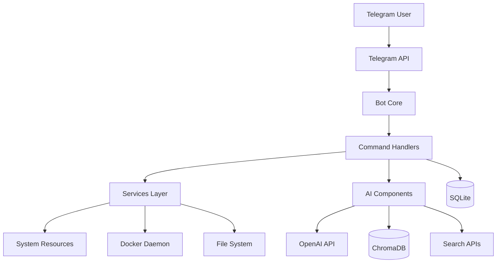
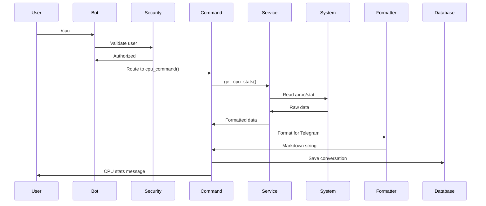
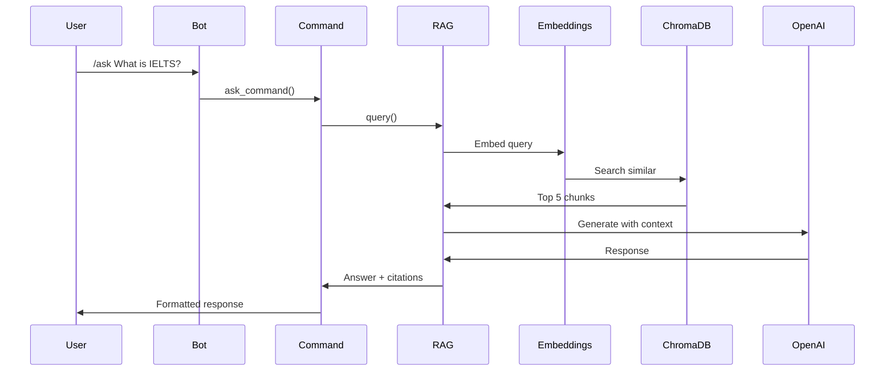
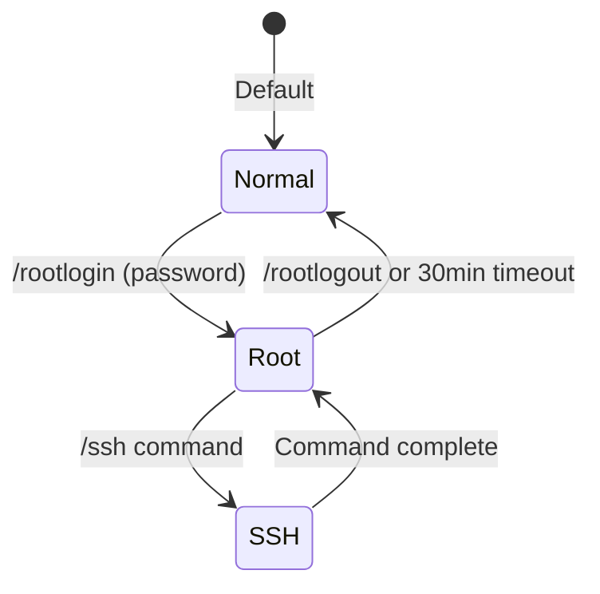

# Architecture

System design and technical architecture of the NAS Telegram AI Assistant.

---

## High-Level Architecture



---

## Component Breakdown

### Bot Core (`bot.py`, `config.py`)

**Purpose**: Main entry point and configuration management

**Responsibilities**:
- Initialize bot application
- Load configuration from `.env`
- Register command handlers
- Start polling loop
- Handle graceful shutdown

**Key files**:
- `bot.py` - Main application
- `config.py` - Configuration loader

---

### Command Handlers (`commands/`)

**Purpose**: Handle user commands and route to services

**Structure**:
```
commands/
├── basic.py          # /start, /help
├── monitoring.py     # /status, /cpu, /ram, /disk
├── docker_cmds.py    # /docker, /restart, /logs
├── filesystem.py     # /ls, /download, /uploadfile
├── ai_cmds.py        # /ask, /chat, /websearch
├── service.py        # /services, /reboot
└── root_cmds.py      # /rootlogin, /ssh
```

**Pattern**:
```python
@require_auth
@rate_limit
async def command(update: Update, context: ContextTypes.DEFAULT_TYPE):
    # 1. Validate input
    # 2. Call service layer
    # 3. Format response
    # 4. Save to database
```

---

### Services Layer (`services/`)

**Purpose**: Business logic and system interactions

**Components**:
- `system_monitor.py` - CPU, RAM, disk metrics
- `docker_service.py` - Docker API interactions
- `smart_monitor.py` - SMART drive health
- `file_service.py` - File system operations
- `service_manager.py` - Systemd service control

**Pattern**:
```python
def get_system_metrics() -> Dict[str, Any]:
    # Interact with system
    # Process data
    # Return structured result
```

---

### AI Components (`ai/`)

**Purpose**: AI and RAG functionality

**Structure**:
```
ai/
├── gpt_client.py           # OpenAI API client
├── rag_engine.py           # RAG pipeline
├── conversation_history.py # Context management
├── search_engine.py        # Internet search
├── document_loader.py      # PDF, DOCX parsing
├── embeddings.py           # Vector embeddings
└── ollama_client.py        # Local AI fallback
```

**RAG Pipeline**:
1. **Document Loader**: Extract text from files
2. **Text Chunker**: Split into manageable pieces
3. **Embeddings**: Convert to vectors
4. **ChromaDB**: Store and index
5. **Query Processing**: Search for relevant chunks
6. **Response Generation**: Send to OpenAI with context

---

### Database (`database/`)

**Purpose**: Persistent data storage

**Files**:
- `models.py` - Database schema and connections
- `memory.py` - Conversation history management

**Schema**:
```sql
-- Conversations
CREATE TABLE conversations (
    id INTEGER PRIMARY KEY,
    user_id INTEGER,
    role TEXT,
    content TEXT,
    timestamp DATETIME
);

-- Commands log
CREATE TABLE commands (
    id INTEGER PRIMARY KEY,
    user_id INTEGER,
    command TEXT,
    output TEXT,
    timestamp DATETIME
);

-- Alerts
CREATE TABLE alerts (
    id INTEGER PRIMARY KEY,
    user_id INTEGER,
    type TEXT,
    message TEXT,
    timestamp DATETIME
);
```

---

### Utilities (`utils/`)

**Purpose**: Cross-cutting concerns

**Components**:
- `security.py` - Auth, rate limiting, path validation
- `formatters.py` - Output formatting for Telegram
- `logger.py` - Logging configuration
- `root_session.py` - Temporary elevated access
- `file_cache.py` - File listing cache

---

### Monitoring (`monitoring/`)

**Purpose**: Automated health checks and alerts

**Components**:
- `health_checker.py` - System health scoring
- `alerts.py` - Alert generation and delivery

**Alert Types**:
- Low disk space (> 80%)
- High CPU (> 90%)
- High memory (> 90%)
- Temperature warnings
- SMART failures
- Container crashes

---

## Data Flow

### User Command Flow



### RAG Query Flow



---

## Security Architecture

### Defense Layers

1. **Authentication**: User whitelist (`ALLOWED_USER_IDS`)
2. **Rate Limiting**: 10 commands/minute
3. **Path Validation**: `ALLOWED_PATHS` restriction
4. **Root Access**: Password + session timeout
5. **Audit Logging**: All actions logged
6. **Input Sanitization**: Command parameter validation

### Root Access Model



---

## Deployment Architecture

### Bare Metal

```
┌─────────────────────────────────────┐
│         Host System (NAS)           │
│  ┌───────────────────────────────┐  │
│  │  Python Virtual Environment   │  │
│  │  ┌─────────────────────────┐  │  │
│  │  │    Bot Application      │  │  │
│  │  │  - bot.py               │  │  │
│  │  │  - Commands             │  │  │
│  │  │  - Services             │  │  │
│  │  │  - AI Components        │  │  │
│  │  └─────────────────────────┘  │  │
│  │                                 │  │
│  │  Accesses:                      │  │
│  │  - File System                  │  │
│  │  - Docker Socket                │  │
│  │  - System Resources             │  │
│  └───────────────────────────────┘  │
└─────────────────────────────────────┘
```

### Docker

```
┌─────────────────────────────────────┐
│         Host System (NAS)           │
│  ┌───────────────────────────────┐  │
│  │    Docker Container           │  │
│  │  ┌─────────────────────────┐  │  │
│  │  │    Bot Application      │  │  │
│  │  │  - Alpine Linux         │  │  │
│  │  │  - Python 3.11          │  │  │
│  │  │  - All dependencies     │  │  │
│  │  └─────────────────────────┘  │  │
│  │                                 │  │
│  │  Volumes:                       │  │
│  │  - ./data → /app/data          │  │
│  │  - ./logs → /app/logs          │  │
│  │  - ./documents → /app/documents│  │
│  │  - /var/run/docker.sock        │  │
│  └───────────────────────────────┘  │
└─────────────────────────────────────┘
```

---

## Technology Stack

### Core
- **Language**: Python 3.11+
- **Bot Framework**: python-telegram-bot 20.7
- **Async**: asyncio, aiohttp

### AI/ML
- **LLM**: OpenAI GPT (GPT-5.4-nano, O3-mini)
- **Vector DB**: ChromaDB 0.4.22
- **Embeddings**: sentence-transformers
- **RAG Framework**: LangChain 1.3+

### System
- **Monitoring**: psutil 5.9+
- **Docker**: docker-py 7.0
- **SMART**: smartmontools (system package)

### Data
- **Database**: SQLite via aiosqlite
- **Document Processing**: PyPDF2, python-docx

### Infrastructure
- **Containerization**: Docker, Docker Compose
- **Service Management**: systemd (bare metal)

---

## Performance Considerations

### Scalability

**Current Design**: Single-user/small team

**Limitations**:
- SQLite (not for high concurrency)
- Single bot instance
- ChromaDB (local, not distributed)

**If Scaling Needed**:
- PostgreSQL instead of SQLite
- Redis for caching
- Distributed ChromaDB
- Load balancer for multiple instances

### Resource Usage

**Typical**:
- RAM: 500MB-2GB (depends on document count)
- CPU: 5-20% idle, spikes during queries
- Disk: 100MB bot + documents + ChromaDB index

**Optimization**:
- Limit indexed documents
- Use efficient embeddings model
- Clear old conversation history
- Docker resource limits

---

## Future Enhancements

### Potential Features
- Voice message support
- Image analysis
- Multi-language support
- Grafana integration for metrics
- Plugin system
- Web dashboard
- Mobile app

### Architecture Improvements
- Microservices architecture
- Message queue (RabbitMQ/Kafka)
- Distributed tracing
- Advanced caching
- GraphQL API

---

**Related**:
- [[Development and Contributing|Development-and-Contributing]] - Contributing guide
- [[Security]] - Security architecture
- [[Docker Deployment|Docker-Deployment]] - Deployment details
